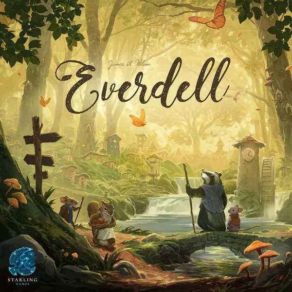

# Everdell AI 

A project to create the best Everdell player agent.

## Overview

This project currently consists of two parts:
1. everdell-simulator [WIP] - a python simulator for the Everdell boardgame that is computer playable
2. everdell-solver [WIP] - a place to write your own Everdell solving agent and to test its performance

## Installation

1. Install pygame and other required packages with conda
2. Launch Game.py

## Documentation

See [docs](./docs/) for the Everdell rules and other game information useful in desigining an Everdell solving program.